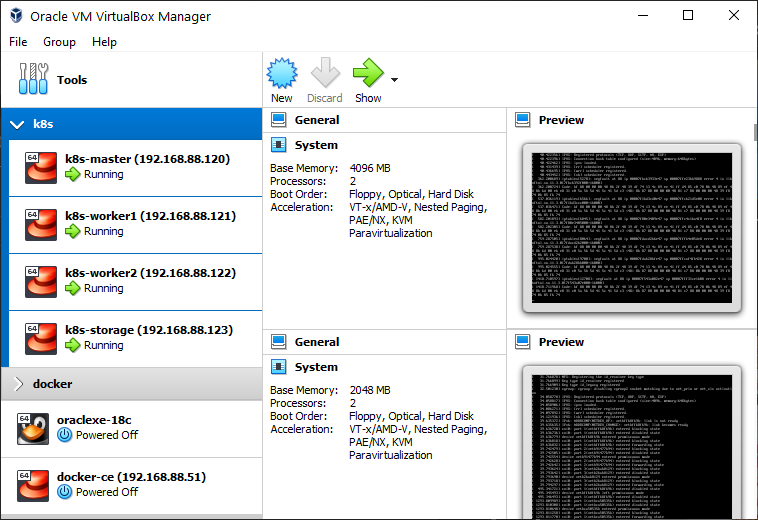
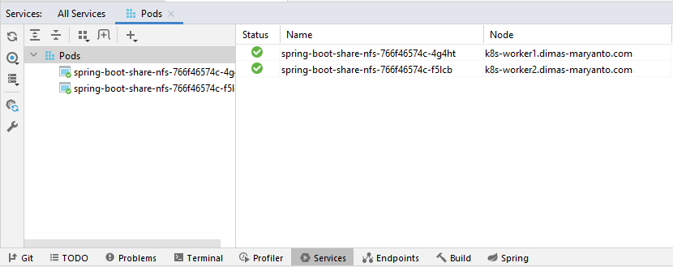
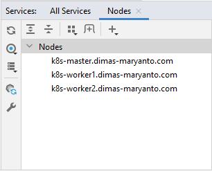
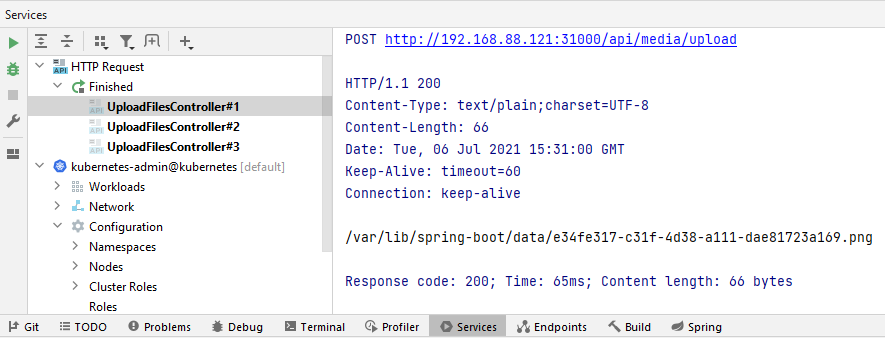
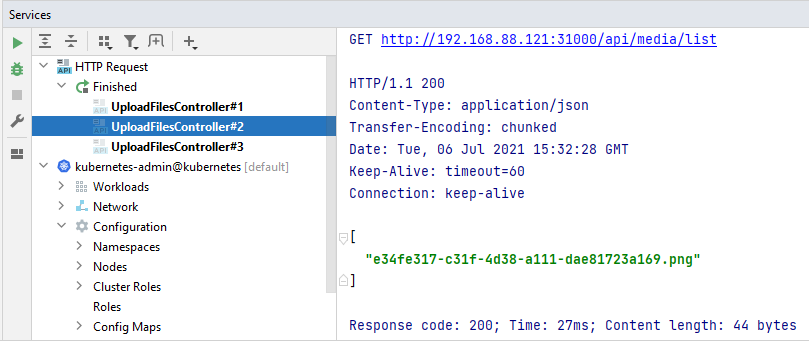
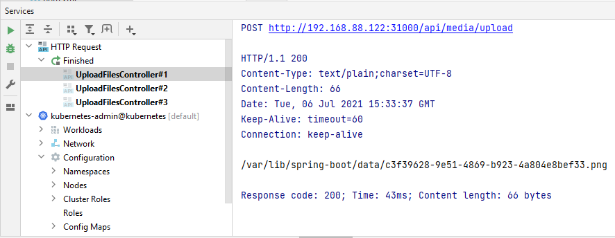
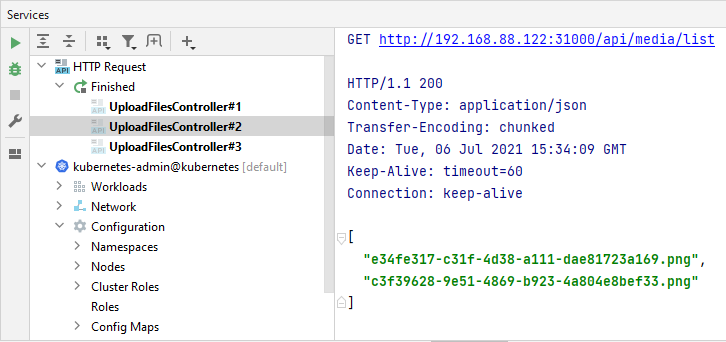

## SpringBoot upload file

Store file using NFS Server, inside pod (kubernetes)

System Required:

- 1x Kubernetes Control Panel
    - CPU: `2cores`
    - RAM: `4Gb`
    - Storage: `20Gbi`
- 2x Kubernetes Workers
    - CPU: `2cores`
    - RAM: `2Gb`
    - Storage: `20Gbi`
- 1x NFS Server Host
    - CPU: `1core`
    - RAM: `2Gb`
    - Storage: `50Gbi`



## Installing NFS Server

Di sini saya menggunakan `CentOS 7` sebagai Operation System storage-nya. Kita akan install NFS Server dan setup mounting-pointnya

```bash
yum install nfs-utils && \
systemctl enable --now nfs-server.service && \
firewall-cmd --permanent --add-service=nfs && \
firewall-cmd --permanent --add-service=rpc-bind && \
firewall-cmd --permanent --add-service=mountd && \
firewall-cmd --reload
```

The configuration files for the NFS server are:

- `/etc/nfs.conf` – main configuration file for the NFS daemons and tools.
- `/etc/nfsmount.conf` – an NFS mount configuration file.

Buat folder yang untuk di share, contohnya `/var/nfs/share`

```bash
mkdir -p /var/nfs/share
```

Kemudian kita exports foldernya yang kita buat, dengan tambahkan konfigurasi pada `/etc/exports` seperti berikut:

```bash
/var/nfs/share	192.168.88.0/24(rw,sync)
```

Setelah itu restart `nfs-server`, dengan perintah seperti berikut:

```bash
systemctl restart nfs-server
```

Check directories yang di export dengan perintah

```bash
exportfs -arv
```

## Deployment

Deploying into kubernetes

```bash
kubectl apply -f .kube/deployment.yaml
```



## Testing

List nodes:



1. Upload from `k8s-worker1`
   
2. List from `k8s-worker1`
   
3. Upload from `k8s-worker2`
   
4. List from `k8s-worker2`
   
